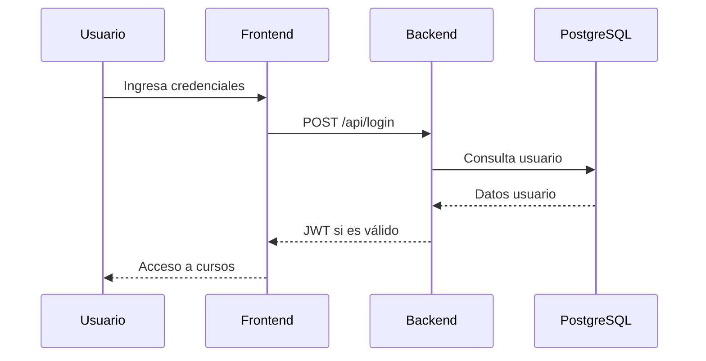

# Diagrama de Arquitectura por Capas

```mermaid
flowchart LR
	A[Frontend (presentation/)] -->|Solicitudes API| B[Backend Flask]
	B --> C[Servicios (business_py/)]
	C --> D[Repositorios (data_py/)]
	D --> E[(PostgreSQL)]
	B -->|Archivos estáticos| A
```

# Flujo de Autenticación


# Arquitectura

CodeKids utiliza una arquitectura por capas, moderna y fácil de mantener:

## 1. Capa de Presentación (`presentation/`)
Contiene todos los archivos HTML, CSS y JavaScript que forman la interfaz visual. Incluye:
- Páginas: inicio, login, registro, cursos, curso individual.
- Animaciones, estilos responsivos y validaciones en el navegador.
- Navegación protegida por sesión.

## 2. Capa de Lógica de Negocio (`business_py/`)
Servicios Python que gestionan la lógica de la aplicación:
- Validación de usuarios y contraseñas.
- Gestión de cursos y conocimientos.
- Reglas de negocio para registro, login y acceso a cursos.

## 3. Capa de Datos (`data_py/`)
Repositorios Python que interactúan con PostgreSQL:
- Consultas y persistencia de usuarios y cursos.
- Uso de psycopg2 para conexión segura.

## 4. Backend (Flask)
El servidor Flask expone la API REST y sirve los archivos estáticos del frontend.
- Endpoints protegidos con JWT.
- Manejo de sesiones y autenticación.

## 5. Infraestructura (Docker)
El despliegue se realiza con Docker y docker-compose:
- Un contenedor para la aplicación Flask.
- Un contenedor para PostgreSQL con volumen persistente.

Esta arquitectura permite escalar, mantener y desplegar CodeKids fácilmente en cualquier entorno.