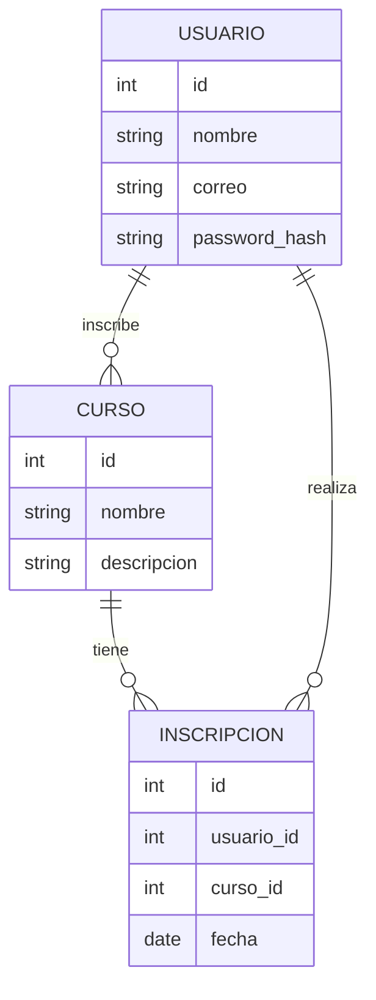

# Diagrama Entidad-Relación (ER)

# Tabla de Entidades

| Entidad      | Campos principales                        |
|--------------|-------------------------------------------|
| USUARIO      | id, nombre, correo, password_hash         |
| CURSO        | id, nombre, descripcion                   |
| INSCRIPCION  | id, usuario_id, curso_id, fecha           |

# Base de Datos

La plataforma utiliza PostgreSQL como sistema de gestión de base de datos relacional. Toda la información de usuarios y cursos se almacena de forma segura y persistente.

## Tablas principales

### usuarios
| Campo           | Tipo         | Descripción                       |
|-----------------|-------------|-----------------------------------|
| id              | SERIAL       | Identificador único               |
| nombre          | VARCHAR(100) | Nombre del usuario                |
| apellido        | VARCHAR(100) | Apellido del usuario              |
| email           | VARCHAR(255) | Correo electrónico (único)        |
| password_hash   | VARCHAR(255) | Contraseña hasheada               |
| edad            | INTEGER      | Edad del usuario                  |
| fecha_registro  | TIMESTAMP    | Fecha de registro                 |
| activo          | BOOLEAN      | Usuario activo o no               |

### cursos
| Campo           | Tipo         | Descripción                       |
|-----------------|-------------|-----------------------------------|
| id              | SERIAL       | Identificador único               |
| titulo          | VARCHAR(200) | Título del curso                  |
| descripcion     | TEXT         | Descripción del curso             |
| nivel           | VARCHAR(50)  | Nivel (principiante/intermedio/avanzado) |
| duracion_horas  | INTEGER      | Duración estimada en horas        |
| edad_minima     | INTEGER      | Edad mínima recomendada           |
| edad_maxima     | INTEGER      | Edad máxima recomendada           |
| fecha_creacion  | TIMESTAMP    | Fecha de creación                 |
| activo          | BOOLEAN      | Curso activo o no                 |

## Inicialización
La base de datos se inicializa automáticamente al levantar los contenedores Docker, ejecutando el script `init-db.sql` que crea las tablas y carga los cursos iniciales.

## Seguridad
- Las contraseñas se almacenan siempre hasheadas.
- El acceso a la base de datos está restringido al backend Flask.