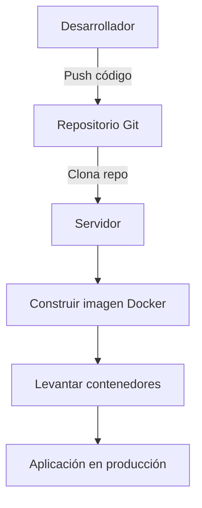

# Diagrama de Flujo de Despliegue

# Tabla de Comandos Principales

| Acción                        | Comando                                  |
|------------------------------|------------------------------------------|
| Construir imagen Docker      | docker-compose build                      |
| Levantar servicios           | docker-compose up -d                      |
| Ver logs                     | docker-compose logs                       |
| Migrar base de datos         | docker-compose exec backend flask db upgrade |
| Detener servicios            | docker-compose down                       |

# Despliegue

## Requisitos
- Docker
- docker-compose

## Despliegue Local
1. Clona el repositorio: `git clone https://github.com/tu-usuario/codekids.git`
2. Navega al directorio: `cd codekids`
3. Ejecuta: `docker-compose up --build`
4. Accede a la plataforma en [http://localhost:3000](http://localhost:3000)

La aplicación Flask y la base de datos PostgreSQL se levantan automáticamente en contenedores separados. Los datos de la base se mantienen en un volumen persistente.

## Variables de entorno
Puedes personalizar usuarios, contraseñas y puertos editando el archivo `docker-compose.yml` y las variables de entorno del backend.

## Despliegue en Producción
- Usa servicios como Azure Container Instances, AWS ECS, Google Cloud Run o cualquier plataforma compatible con Docker.
- Configura dominios, certificados SSL y backups de base de datos según tus necesidades.

## Consejos
- Para desarrollo, puedes usar `docker-compose down` para detener y limpiar los contenedores.
- Para actualizar la base de datos, edita `init-db.sql` y reinicia los servicios.